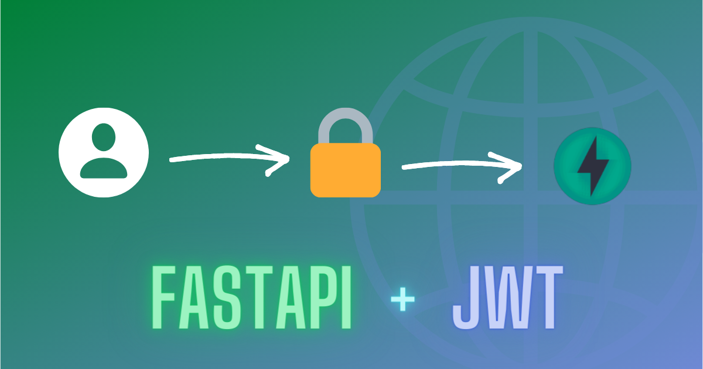
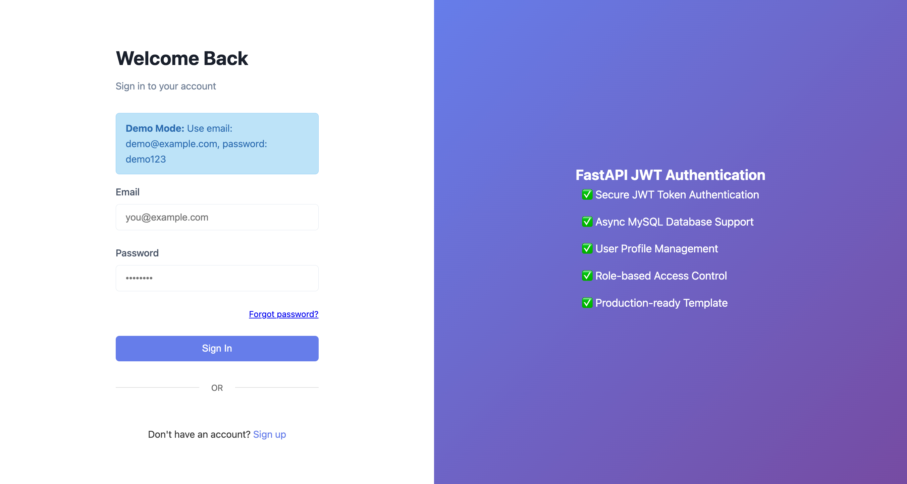
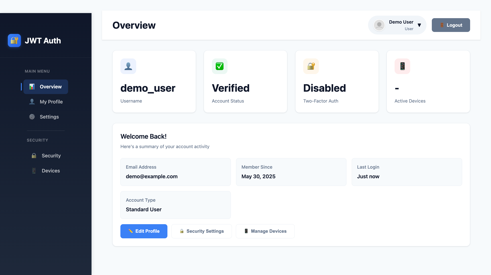
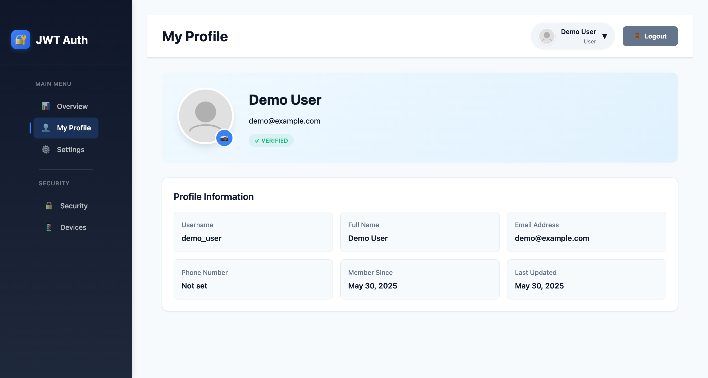
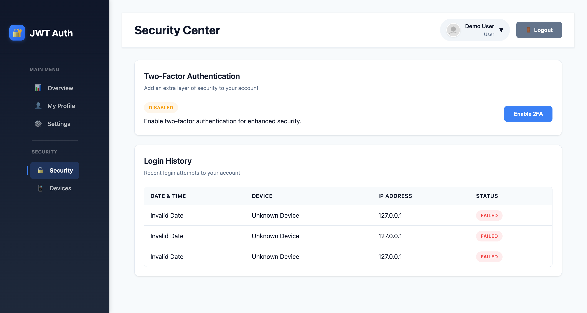

# FastAPI JWT Auth System

<div align="center">
  


<h3>🔐 Modern Authentication System for FastAPI Applications</h3>

[](https://www.python.org/downloads/)
[](https://fastapi.tiangolo.com/)
[](https://www.sqlalchemy.org/)
[](https://jwt.io/)
[](LICENSE)

[](https://www.docker.com/)
[](https://www.mysql.com/)
[](https://redis.io/)
[](https://swagger.io/)

[](https://github.com/psf/black)
[](https://github.com/pyca/bcrypt/)
[](https://docs.python.org/3/library/asyncio.html)
[](https://pytest.org/)

[](https://github.com/Evil0ctal/fastapi-jwt-auth/stargazers)
[](https://github.com/Evil0ctal/fastapi-jwt-auth/network/members)
[](https://github.com/Evil0ctal/fastapi-jwt-auth/issues)
[](https://github.com/Evil0ctal/fastapi-jwt-auth/pulls)

**🚀 A production-ready authentication system built with FastAPI**

<p align="center">
  <a href="#-features">Features</a> •
  <a href="#-screenshots">Screenshots</a> •
  <a href="#-quick-start">Quick Start</a> •
  <a href="#-api-documentation">API Docs</a> •
  <a href="#-deployment">Deploy</a> •
  <a href="#-contributing">Contributing</a>
</p>
</div>

---

## 🛠️ Technologies & Tools

<p align="center">
  
  
  
  
  
  
</p>

<p align="center">
  
  
  
  
  
  
</p>

---

## 📸 Screenshots

<div align="center">
  
  
</div>

<div align="center">
  
  
</div>

## ✨ Features

### Core Authentication
- 🔐 **JWT Authentication** - Secure token-based authentication with access and refresh tokens
- 🔄 **Token Refresh** - Automatic token refresh mechanism
- 📧 **Email Verification** - Email-based account verification
- 🔑 **Password Reset** - Secure password reset via email

### Advanced Security
- 🛡️ **Two-Factor Authentication (2FA)** - TOTP-based 2FA with QR codes
- 📱 **Device Management** - Track and manage logged-in devices
- 📊 **Login History** - Monitor login attempts and locations
- ⚡ **Rate Limiting** - Protect against brute force attacks

### Social Login
- 🌐 **OAuth2 Integration** - Support for multiple providers
- 🔗 **Google Login** - Sign in with Google account
- 🐙 **GitHub Login** - Sign in with GitHub account

### User Management
- 👤 **User Profiles** - Customizable user profiles with avatars
- 👨‍💼 **Admin Panel** - User management for administrators
- 📸 **Avatar Upload** - Profile picture upload with image processing

### Modern UI/UX
- 🎨 **Beautiful Dashboard** - Modern, responsive design
- 📱 **Mobile Friendly** - Fully responsive on all devices
- 🌓 **Clean Interface** - Intuitive and user-friendly

## 🚀 Quick Start

### Prerequisites

- Python 3.8+ (Recommended: 3.11)
- MySQL 8.0+ (optional, SQLite by default)
- SMTP server (optional, for email features)
- Docker & Docker Compose (optional, for containerized deployment)

### 1. Fork and Clone

```bash
# Fork this repository on GitHub first, then clone your fork
git clone https://github.com/Evil0ctal/fastapi-jwt-auth.git
cd fastapi-jwt-auth

# Create virtual environment
python -m venv venv

# Activate virtual environment
# On Windows:
venv\Scripts\activate
# On macOS/Linux:
source venv/bin/activate

# Install dependencies
pip install -r requirements.txt
```

### 2. Configure Environment

```bash
# Create .env file from example
cp .env.example .env

# Edit .env file with your settings
# For quick start, the default settings work out of the box!
```

### 3. Initialize Database

```bash
# Run database initialization
python init_db.py

# This will:
# - Create all database tables
# - Create a demo user (if APP_MODE=demo)
# - Optionally create a superuser account
```

### 4. Run the Application

```bash
# Start the application
python run.py

# Or use uvicorn directly
uvicorn app.main:app --reload --port 8000
```

### 5. Access the Application

Open your browser and navigate to:
- 🌐 **Application**: http://localhost:8000
- 📚 **API Docs**: http://localhost:8000/docs
- 🔧 **ReDoc**: http://localhost:8000/redoc

**Demo Credentials** (if APP_MODE=demo):
- Email: `demo@example.com`
- Password: `demo123`

## 📁 Project Structure

```
fastapi-jwt-auth/
├── app/                        # Application core
│   ├── api/                    # API endpoints
│   │   ├── auth.py            # Authentication endpoints
│   │   ├── users.py           # User management endpoints
│   │   ├── oauth.py           # OAuth2 endpoints
│   │   ├── two_factor_auth.py # 2FA endpoints
│   │   └── devices.py         # Device management endpoints
│   ├── core/                   # Core functionality
│   │   ├── config.py          # Configuration settings
│   │   ├── security.py        # Security utilities
│   │   ├── logging.py         # Logging configuration
│   │   └── rate_limit.py      # Rate limiting
│   ├── db/                     # Database
│   │   ├── base.py            # Database base classes
│   │   └── database.py        # Database connection
│   ├── models/                 # SQLAlchemy models
│   │   ├── user.py            # User model
│   │   ├── oauth_account.py   # OAuth accounts
│   │   ├── two_factor_auth.py # 2FA model
│   │   └── ...                # Other models
│   ├── schemas/                # Pydantic schemas
│   │   ├── user.py            # User schemas
│   │   ├── token.py           # Token schemas
│   │   └── ...                # Other schemas
│   ├── services/               # Business logic
│   │   ├── user.py            # User service
│   │   ├── email.py           # Email service
│   │   ├── oauth.py           # OAuth service
│   │   └── ...                # Other services
│   ├── templates/              # Email templates
│   │   └── emails/            # HTML email templates
│   └── main.py                # Application entry point
├── static/                     # Frontend files
│   ├── css/                   # Stylesheets
│   ├── js/                    # JavaScript files
│   ├── images/                # Images
│   ├── dashboard.html         # Main dashboard
│   ├── login.html             # Login page
│   └── ...                    # Other pages
├── tests/                      # Test files
├── .env.example               # Environment example
├── requirements.txt           # Python dependencies
├── run.py                     # Application runner
└── init_db.py                 # Database initialization
```

## 🛠️ Development Guide

### Adding New Features

1. **Create a New API Endpoint**

```python
# app/api/your_feature.py
from fastapi import APIRouter, Depends
from app.api.deps import get_current_user

router = APIRouter()

@router.get("/your-endpoint")
async def your_endpoint(current_user = Depends(get_current_user)):
    # Your logic here
    return {"message": "Hello from your endpoint"}
```

2. **Register the Router**

```python
# app/main.py
from app.api import your_feature

app.include_router(
    your_feature.router,
    prefix="/api/v1/your-feature",
    tags=["your-feature"]
)
```

3. **Add Frontend Page**

Create a new section in `dashboard.html`:

```javascript
// Add to navigation
<li>
    <a class="nav-link" data-section="your-section">
        <span class="nav-icon">🎯</span>
        <span>Your Feature</span>
    </a>
</li>

// Add section content
<section id="your-section" class="section">
    <!-- Your content here -->
</section>
```

### Customizing the UI

1. **Colors and Theme**

Edit CSS variables in `dashboard.html`:

```css
:root {
    --primary-color: #3b82f6;  /* Change primary color */
    --dark-bg: #0f172a;        /* Change sidebar color */
    /* ... other variables ... */
}
```

2. **Adding Dashboard Widgets**

Add new stat cards in the overview section:

```html
<div class="stat-card">
    <div class="stat-icon primary">📊</div>
    <div class="stat-value">42</div>
    <div class="stat-label">Your Metric</div>
</div>
```

### Database Models

1. **Create a New Model**

```python
# app/models/your_model.py
from sqlalchemy import Column, Integer, String, ForeignKey
from app.db.base import Base

class YourModel(Base):
    __tablename__ = "your_table"
    
    id = Column(Integer, primary_key=True)
    name = Column(String(100), nullable=False)
    user_id = Column(Integer, ForeignKey("users.id"))
```

2. **Create Pydantic Schema**

```python
# app/schemas/your_schema.py
from pydantic import BaseModel

class YourModelCreate(BaseModel):
    name: str

class YourModelResponse(BaseModel):
    id: int
    name: str
    
    class Config:
        from_attributes = True
```

### Component Design

#### 1. **Authentication Flow**
```
User Registration → Email Verification → Login → JWT Token → Access Protected Routes
                                           ↓
                                    Refresh Token → New Access Token
```

#### 2. **Database Models**
- **User**: Core user information
- **RefreshToken**: JWT refresh tokens
- **UserDevice**: Trusted devices
- **LoginHistory**: Login attempts
- **TwoFactorAuth**: 2FA settings
- **OAuthAccount**: Social login connections

#### 3. **Security Layers**
- Password hashing with bcrypt
- JWT tokens with expiration
- Rate limiting per IP/user
- Device fingerprinting
- Optional 2FA verification

### Customizing the UI

1. **Colors and Theme**

Edit CSS variables in `dashboard.html`:

```css
:root {
    --primary-color: #3b82f6;  /* Change primary color */
    --dark-bg: #0f172a;        /* Change sidebar color */
    /* ... other variables ... */
}
```

2. **Adding Dashboard Widgets**

Add new stat cards in the overview section:

```html
<div class="stat-card">
    <div class="stat-icon primary">📊</div>
    <div class="stat-value">42</div>
    <div class="stat-label">Your Metric</div>
</div>
```

### Database Models

1. **Create a New Model**

```python
# app/models/your_model.py
from sqlalchemy import Column, Integer, String, ForeignKey
from app.db.base import Base

class YourModel(Base):
    __tablename__ = "your_table"
    
    id = Column(Integer, primary_key=True)
    name = Column(String(100), nullable=False)
    user_id = Column(Integer, ForeignKey("users.id"))
```

2. **Create Pydantic Schema**

```python
# app/schemas/your_schema.py
from pydantic import BaseModel

class YourModelCreate(BaseModel):
    name: str

class YourModelResponse(BaseModel):
    id: int
    name: str
    
    class Config:
        from_attributes = True
```

## 🔧 Configuration

### Environment Variables

| Variable | Description | Default |
|----------|-------------|---------|  
| `APP_MODE` | Application mode (demo/production) | `demo` |
| `SECRET_KEY` | JWT secret key | `change-in-production` |
| `DATABASE_URL` | Database connection URL | `sqlite:///./app.db` |
| `DATABASE_TYPE` | Database type (sqlite/mysql) | `sqlite` |
| `EMAIL_ENABLED` | Enable email features | `false` |
| `RATE_LIMIT_ENABLED` | Enable rate limiting | `true` |
| `GOOGLE_CLIENT_ID` | Google OAuth client ID | `""` |
| `GOOGLE_CLIENT_SECRET` | Google OAuth secret | `""` |
| `GITHUB_CLIENT_ID` | GitHub OAuth client ID | `""` |
| `GITHUB_CLIENT_SECRET` | GitHub OAuth secret | `""` |

See `.env.example` for all configuration options.

### OAuth2 Setup

1. **Google OAuth**
   - Create project at [Google Cloud Console](https://console.cloud.google.com/)
   - Enable Google+ API
   - Create OAuth2 credentials
   - Add redirect URI: `http://localhost:8000/api/v1/oauth/callback/google`

2. **GitHub OAuth**
   - Go to GitHub Settings > Developer settings > OAuth Apps
   - Create new OAuth App
   - Add authorization callback: `http://localhost:8000/api/v1/oauth/callback/github`

## 📦 API Documentation

### Authentication Endpoints

| Method | Endpoint | Description |
|--------|----------|-------------|
| POST | `/api/v1/auth/register` | Register new user |
| POST | `/api/v1/auth/login` | Login user |
| POST | `/api/v1/auth/logout` | Logout user |
| POST | `/api/v1/auth/refresh` | Refresh access token |
| POST | `/api/v1/auth/forgot-password` | Request password reset |
| POST | `/api/v1/auth/reset-password` | Reset password |
| POST | `/api/v1/auth/verify-email` | Verify email address |

### User Endpoints

| Method | Endpoint | Description |
|--------|----------|-------------|
| GET | `/api/v1/users/me` | Get current user |
| PUT | `/api/v1/users/me` | Update current user |
| POST | `/api/v1/users/me/avatar` | Upload avatar |
| DELETE | `/api/v1/users/me/avatar` | Delete avatar |
| PUT | `/api/v1/users/me/password` | Change password |
| GET | `/api/v1/users/` | List all users (admin) |

### Security Endpoints

| Method | Endpoint | Description |
|--------|----------|-------------|
| GET | `/api/v1/2fa/status` | Get 2FA status |
| POST | `/api/v1/2fa/setup` | Setup 2FA |
| POST | `/api/v1/2fa/verify` | Verify 2FA code |
| DELETE | `/api/v1/2fa/disable` | Disable 2FA |
| GET | `/api/v1/devices/` | List user devices |
| DELETE | `/api/v1/devices/{device_id}` | Remove device |
| GET | `/api/v1/devices/login-history` | Get login history |

See full API documentation at `/docs` when running the application.

## 🧪 Testing

```bash
# Run all tests
python run_tests.py

# Run specific test file
python run_tests.py test_auth.py

# Run with coverage
python run_tests.py --coverage

# Run tests by module
python run_tests.py --modules
```

## 🚀 Deployment

### Docker Deployment

#### Quick Start with Docker Compose

```bash
# Clone the repository
git clone https://github.com/Evil0ctal/fastapi-jwt-auth.git
cd fastapi-jwt-auth

# Copy environment file
cp .env.example .env

# Start services
docker-compose up -d

# Initialize database (first time only)
docker-compose exec app python init_db.py
```

The application will be available at:
- Application: http://localhost:8000
- API Docs: http://localhost:8000/docs

#### Production Deployment

```bash
# Use production profile with Nginx
docker-compose --profile production up -d
```

This will start:
- FastAPI application on port 8000
- MySQL database on port 3306  
- Nginx reverse proxy on port 80

### Production Checklist

- [ ] **Security**
  - [ ] Change `SECRET_KEY` to a strong random value
  - [ ] Enable HTTPS with SSL certificates (Let's Encrypt)
  - [ ] Configure CORS origins properly
  - [ ] Review and adjust rate limiting settings
  
- [ ] **Database**
  - [ ] Use MySQL or PostgreSQL instead of SQLite
  - [ ] Set up regular automated backups
  - [ ] Configure connection pooling
  
- [ ] **Monitoring**
  - [ ] Set up application monitoring (Prometheus/Grafana)
  - [ ] Configure centralized logging (ELK stack)
  - [ ] Set up error tracking (Sentry)
  
- [ ] **Performance**
  - [ ] Enable Redis for caching
  - [ ] Configure CDN for static assets
  - [ ] Set up horizontal scaling with load balancer

## 🐛 Known Issues & Troubleshooting

### Common Issues

1. **Port Already in Use**
   - The application automatically tries port 8001 if 8000 is occupied
   - Or manually change the port in `run.py` or docker-compose.yml

2. **Database Connection Issues**
   - Ensure MySQL service is running if using MySQL
   - Check database credentials in `.env` file
   - For Docker, wait for MySQL to be fully initialized

3. **Email Not Sending**
   - Verify SMTP settings in `.env`
   - For Gmail, use App Passwords instead of regular password
   - Check if `EMAIL_ENABLED=true`

4. **OAuth Login Not Working**
   - Verify OAuth credentials are correctly set
   - Ensure callback URLs match your domain
   - Check if frontend URL is correctly configured

## 🤝 Contributing

1. Fork the repository
2. Create your feature branch (`git checkout -b feature/AmazingFeature`)
3. Commit your changes (`git commit -m 'Add some AmazingFeature'`)
4. Push to the branch (`git push origin feature/AmazingFeature`)
5. Open a Pull Request

### Development Setup

```bash
# Install in development mode
pip install -r requirements.txt

# Run tests
python run_tests.py

# Run with auto-reload
uvicorn app.main:app --reload
```

## 📄 License

This project is licensed under the MIT License - see the [LICENSE](LICENSE) file for details.

## 🙏 Acknowledgments

- [FastAPI](https://fastapi.tiangolo.com/) - The awesome web framework
- [SQLAlchemy](https://www.sqlalchemy.org/) - The database toolkit
- [Pydantic](https://pydantic-docs.helpmanual.io/) - Data validation library
- All contributors who helped build this project

## 🔒 Security

<p align="center">
  
  
  
</p>

This project implements several security best practices:

- 🔐 **Password Security**: Bcrypt hashing with salt rounds
- 🎟️ **JWT Tokens**: Short-lived access tokens with refresh rotation
- 🔄 **Token Rotation**: Automatic refresh token rotation
- 🚫 **Rate Limiting**: Protection against brute force attacks
- ✅ **Input Validation**: Pydantic models for data validation
- 💾 **SQL Injection Protection**: SQLAlchemy ORM with parameterized queries
- 🌐 **XSS Protection**: Template sanitization and CSP headers
- 🌐 **CORS**: Configurable cross-origin resource sharing
- 🔐 **2FA Support**: TOTP-based two-factor authentication

For security concerns, please email: evil0ctal1985@gmail.com

## 📈 Performance

- **Async/await** throughout for optimal performance
- **Connection pooling** for database
- **Lazy loading** of relationships
- **Optimized queries** with proper indexing
- **Static file caching** with proper headers
- **Multi-stage Docker builds** for smaller images

## 📞 Support

- 📖 [Documentation](https://github.com/Evil0ctal/fastapi-jwt-auth/wiki)
- 🐛 [Issue Tracker](https://github.com/Evil0ctal/fastapi-jwt-auth/issues)
- 💬 [Discussions](https://github.com/Evil0ctal/fastapi-jwt-auth/discussions)
- 📧 Email: evil0ctal1985@gmail.com

---

<div align="center">
  
**If you find this project useful, please consider giving it a ⭐!**

Made with ❤️ using FastAPI

[Report Bug](https://github.com/Evil0ctal/fastapi-jwt-auth/issues) • [Request Feature](https://github.com/Evil0ctal/fastapi-jwt-auth/issues)

</div>